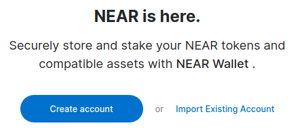
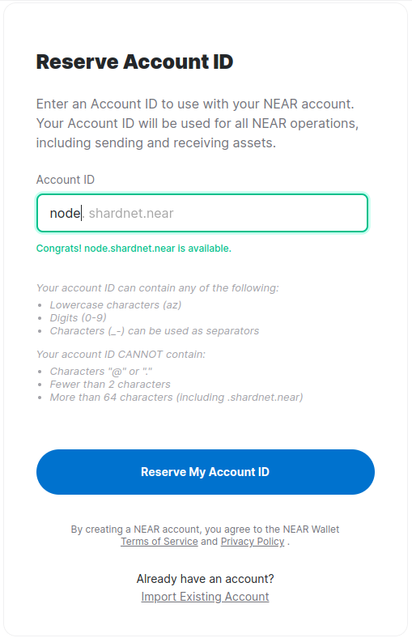
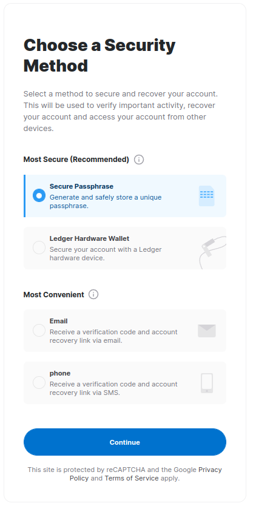
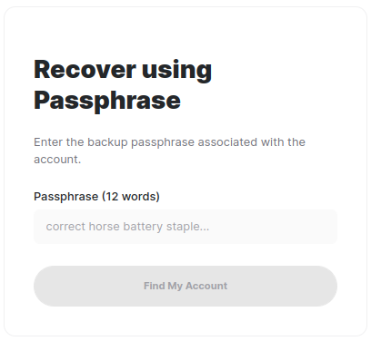
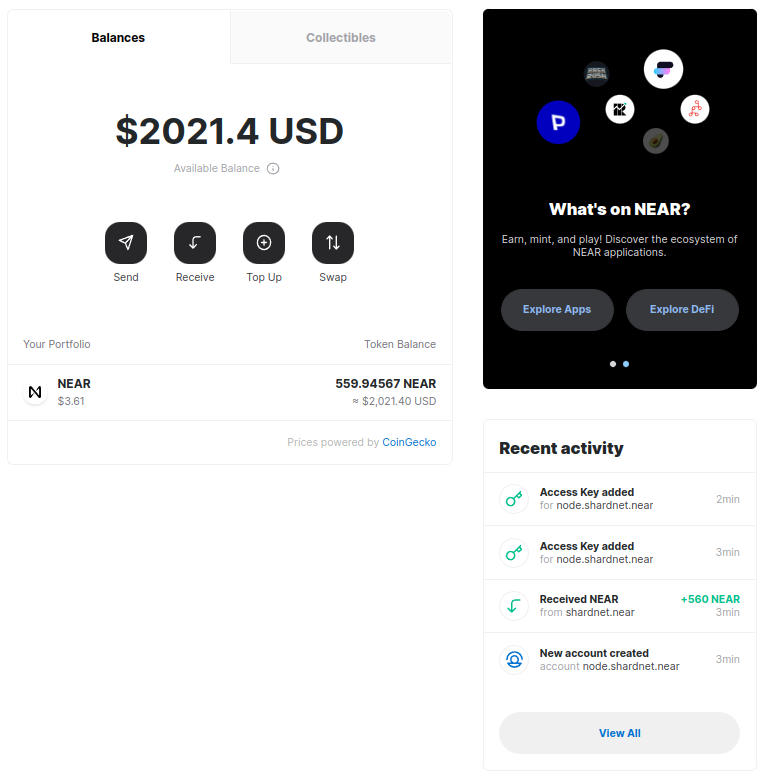
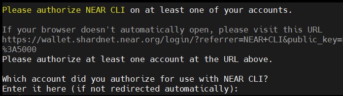
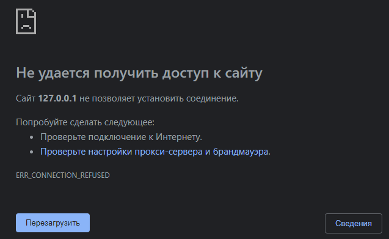

# NEAR. Stake Wars: Episode III
## Запуск валидатора "Chunk-only Producer" в сети shardnet.

Stake Wars — это программа, которая помогает сообществу ознакомиться с тем, что значит быть валидатором NEAR, и дает им ранний шанс получить доступ к Сhunk-only producer. Вознаграждения, предлагаемые программой Stake Wars, поддерживают новых участников, которые хотят присоединиться к основной сети в качестве валидатора, начиная с сентября 2022 года.
## Навигация
* [Начало](#начнём)
* [Создание кошелька](#создание-кошелька)
* [Запуск узла](#запуск-узла)
* [Активация узла в качестве валидатора](#активация-узла-в-качестве-валидатора)
* [Запуск стейкинг пула](#запуск-стейкинг-пула)
* [Создайте cron задачу для автоматического пинга](#создайте-cron-задачу-для-автоматического-пинга))
* [Руководство по командам NEAR CLI](#руководство-по-командам-near-cli)
* [Руководство по транзакциям](#руководство-по-транзакциям)
* [RPC](#rpc)
* [Общие команды](#общие-команды)
### Начнём!
* О программе Stake Wars: https://near.org/stakewars/
* Что такое Chunk-only Producer: https://near.org/decentralize/
* Заполните форму для регистрация Chunk-Only Producer: https://nearprotocol1001.typeform.com/to/Z39N7cU9?typeform-source=x50.medium.com
* Аренда сервера: https://accounts.hetzner.com/
### Требования к серверу:
| Оборудование   | Спецификации производителя                                      |
| -------------- | --------------------------------------------------------------- |
| CPU            | 4-Core CPU with AVX support                                     |
| RAM            | 8GB DDR4                                                        |
| Storage        | 500GB SSD                                                       |
## Создание кошелька
Перейдя на сайт https://wallet.shardnet.near.org/ нажмите "Создать учетную запись":



Введите свободное имя пользователя и нажмите "Reserve My Account ID":



Выбирите подходящий для вас метод восстановления (мне ближе мнемоническая фраза):



Сохраните мнемоническую фразу, и введите ее далее:



В результате у ваc будут NEAR:


## Запуск узла
### Обновите пакеты:
``` 
sudo apt update && sudo apt upgrade -y
```
### Устанавите Node.js и npm
``` 
curl -sL https://deb.nodesource.com/setup_18.x | sudo -E bash -  
sudo apt install build-essential nodejs
PATH="$PATH"
```
Проверьте версии `Node.js` и `npm`
```
node -v
```
> v18.x.x

```
npm -v
```
> 8.x.x
### Установите `NEAR-CLI`
```
sudo npm install -g near-cli
``` 
### Настройте окружающую среду
```
export NEAR_ENV=shardnet
echo 'export NEAR_ENV=shardnet' >> ~/.bashrc
```
### Установите инструменты разработчика
```
sudo apt install -y git binutils-dev libcurl4-openssl-dev zlib1g-dev libdw-dev libiberty-dev cmake gcc g++ python docker.io protobuf-compiler libssl-dev pkg-config clang llvm cargo
```
### Установите `python3-pip`
```
sudo apt install python3-pip
```
### Установите конфигурацию
```
USER_BASE_BIN=$(python3 -m site --user-base)/bin
export PATH="$USER_BASE_BIN:$PATH"
```
### Установите `building env`
```
sudo apt install clang build-essential make
```
### Установите `rust` и `cargo`
```
curl --proto '=https' --tlsv1.2 -sSf https://sh.rustup.rs | sh
```
Вводим `1` и enter
```
source $HOME/.cargo/env
```
### Клонируйте [`nearcore` репозиторий](https://github.com/near/nearcore).
```
git clone https://github.com/near/nearcore
cd nearcore
git fetch
```
Далее проверьте `<commit>` [`в` данном файле](https://github.com/near/stakewars-iii/blob/main/commit.md)
```
git checkout <commit>
```
Замените его на значение из файла. В моем варианте команда выглядит так:
```
git checkout 0f81dca95a55f975b6e54fe6f311a71792e21698
```
### Скомпилируйте бинарный файл
```
cargo build -p neard --release --features shardnet
```
### Инициализируйте рабочую директорию
Для правильной работы узлу NEAR требуется рабочий каталог и несколько файлов конфигурации.
```
./target/release/neard --home ~/.near init --chain-id shardnet --download-genesis
```
Эта команда создаст структуру каталогов и сгенерирует `config.json`, `node_key.json`, и `genesis.json`
### Замените `config.json`
```
rm ~/.near/config.json
wget -O ~/.near/config.json https://s3-us-west-1.amazonaws.com/build.nearprotocol.com/nearcore-deploy/shardnet/config.json
```
### Установите AWS Cli
```
sudo apt-get install awscli -y
```
### Замените genesis.json
```
rm ~/.near/genesis.json
cd ~/.near
wget https://s3-us-west-1.amazonaws.com/build.nearprotocol.com/nearcore-deploy/shardnet/genesis.json
```
## Активация узла в качестве валидатора
### Введите в терминале команду
```
near login
```
### Cкопируйте ссылку и вставьте её в браузер

### Предоставьте полный доступ Near CLI, нажимайте "Next", далее "Подключить".
### Введите название вашего кошелька и нажмите "Подтвердить". После этого вы увидите такую страницу, это нормально:

### Введите в терминале вашу учетную запись, нажмите `enter`
### Проверьте validator_key.json
```
cat ~/.near/validator_key.json
```
### Если файл `validator_key.json` отсутствует, выполните следующие действия, чтобы создать его:
```
near generate-key <pool_id>
```
`<pool_id>` это `XX.factory.shardnet.near` , где `XX` имя вашего пула.

Пример (не повторяйте):
```
near generate-key node.factory.shardnet.near
```
### Скопируйте сгенерированный файл в папку shardnet
```
cp ~/.near-credentials/shardnet/YOUR_WALLET.json ~/.near/validator_key.json
```
YOUR_WALLET замените на ваше имя, пример (не повторяйте):
```
cp ~/.near-credentials/shardnet/node.shardnet.near.json ~/.near/validator_key.json
```
### Отредактируйте validator_key.json
```
nano ~/.near/validator_key.json
```
* Отредактируйте «account_id» => `XX.factory.shardnet.near`, где `XX` — имя вашего пула.
* Измените `private_key` на `secret_key`

Содержимое файла должно соответствовать следующему шаблону:
```
{
  "account_id": "XX.factory.shardnet.near",
  "public_key": "ed25519:HeaBJ3xLgvZacQWmEctTeUqyfSU4SDEnEwckWxd92W2G",
  "secret_key": "ed25519:****"
}
```
### Создайте сервисный файл
```
sudo nano /etc/systemd/system/neard.service
```
Вставляем следующий текст в файл:
```
[Unit]
Description=NEARd Daemon Service

[Service]
Type=simple
User=<USER>
#Group=near
WorkingDirectory=/home/<USER>/.near
ExecStart=/home/<USER>/nearcore/target/release/neard run
Restart=on-failure
RestartSec=30
KillSignal=SIGINT
TimeoutStopSec=45
KillMode=mixed

[Install]
WantedBy=multi-user.target
```
Отредактирует строки `USER`, `WorkingDirectory`, `ExecStart` под ваши значения
### Запустите узел валидатора
```
sudo systemctl daemon-reload
sudo systemctl enable neard
sudo systemctl start neard
```
### Отобразите цветные логи
```
sudo apt install ccze
journalctl -n 100 -f -u neard | ccze -A
```
### Дожидаемся полной синхронизации
## Запуск стейкинг пула
### Разверните контракт стейкинг пула, шаблон команды
```
near call factory.shardnet.near create_staking_pool '{"staking_pool_id": "<pool id>", "owner_id": "<accountId>", "stake_public_key": "<public key>", "reward_fee_fraction": {"numerator": 5, "denominator": 100}, "code_hash":"DD428g9eqLL8fWUxv8QSpVFzyHi1Qd16P8ephYCTmMSZ"}' --accountId="<accountId>" --amount=450 --gas=300000000000000
```
Замените заначения в ковычках <> на свои данные
* **Pool ID**: Имя стейкинг пула. Пример: node
* **Owner ID**: Shardnet аккаунт. Пример: node.shardnet.near
* **Public Key**: public key из файла validator_key.json
* **5**: Комиссия, которую будет взимать пул
* **Account Id**: Shardnet аккаунт. Обычно совпадает с Owner ID

Должно появиться сообщение об успешном создании пула

Проверить пул можно [здесь](https://explorer.shardnet.near.org/nodes/validators).

## Создайте cron задачу для автоматического пинга
```
cd
mkdir scripts
cd scripts
nano ping.sh
```
В тексте файла прописываем:
```
#!/bin/sh
# Ping call to renew Proposal added to crontab

export NEAR_ENV=shardnet
export LOGS=/home/<USER_ID>/logs
export POOLID=<YOUR_POOL_ID>
export ACCOUNTID=<YOUR_ACCOUNT_ID>

echo "---" >> $LOGS/all.log
date >> $LOGS/all.log
near call $POOLID.factory.shardnet.near ping '{}' --accountId $ACCOUNTID.shardnet.near --gas=300000000000000 >> $LOGS/all.log
near proposals | grep $POOLID >> $LOGS/all.log
near validators current | grep $POOLID >> $LOGS/all.log
near validators next | grep $POOLID >> $LOGS/all.log
```
Отредактируйте LOGS, POOLID, ACCOUNTID в зависимости от ваших данных.

Создайте новый crontab, запускаемый каждые 5 минут:
```
crontab -e
```
Прописываем строку с измененным путем к файлу скрипта:
```
*/5 * * * * sh /home/<USER_ID>/scripts/ping.sh
```
Сохраняем и закрываем файл

Просмотр логов
```
cat home/<USER_ID>/logs/all.log
```
## Руководство по командам NEAR CLI
Предложение валидатора указывает на то, что он хотел бы войти в набор валидатора, чтобы предложение было принято, оно должно соответствовать минимальной цене места. Команда:
```
near proposals
```
Cписок активных валидаторов в текущую эпоху, количество произведенных блоков, количество ожидаемых блоков и скорость онлайн. Используется для мониторинга наличия проблем у валидатора. Команда:
```
near validators current
```
Валидаторы, чьё предложение было принято одну эпоху назад, и которые войдут в набор валидаторов в следующую эпоху. Команда:
```
near validators next
```
## Руководство по транзакциям
Депозит и стейкинг NEAR
```
near call <staking_pool_id> deposit_and_stake --amount <amount> --accountId <accountId> --gas=300000000000000
```
Анстейкинг NEAR. Количество в yoctoNEAR
```
near call <staking_pool_id> unstake '{"amount": "<amount yoctoNEAR>"}' --accountId <accountId> --gas=300000000000000
```
Анстейкинг всех NEAR
```
near call <staking_pool_id> unstake_all --accountId <accountId> --gas=300000000000000
```
Вывод. Анстейкинг занимает 2–3 эпохи, после чего вы можете вывести в YoctoNEAR из пула. Команда:
```
near call <staking_pool_id> withdraw '{"amount": "<amount yoctoNEAR>"}' --accountId <accountId> --gas=300000000000000
```
Команда вывести всё:
```
near call <staking_pool_id> withdraw_all --accountId <accountId> --gas=300000000000000
```
Пинг выдаёт новое предложение и обновляет балансы ставок для ваших делегаторов. Каждую эпоху следует отправлять пинг, чтобы сообщать о наградах в актуальном состоянии. Команда:
```
near call <staking_pool_id> ping '{}' --accountId <accountId> --gas=300000000000000
```
Общий баланс
```
near view <staking_pool_id> get_account_total_balance '{"account_id": "<accountId>"}'
```
Стейкинг баланса
```
near view <staking_pool_id> get_account_staked_balance '{"account_id": "<accountId>"}'
```
Анстейкнутый баланс
```
near view <staking_pool_id> get_account_unstaked_balance '{"account_id": "<accountId>"}'
```
Доступно для вывода
```
near view <staking_pool_id> is_account_unstaked_balance_available '{"account_id": "<accountId>"}'
```
Пауза в стейкинге
```
near call <staking_pool_id> pause_staking '{}' --accountId <accountId>
```
Продолжить стейкинг
```
near call <staking_pool_id> resume_staking '{}' --accountId <accountId>
```
## RPC

Любой узел в сети предлагает службы RPC через порт 3030, если этот порт открыт в брандмауэре узла. Обычно RPC используется для проверки статистики валидатора, версии узла и просмотра доли делегатора, его можно использовать для взаимодействия с блокчейном, учетными записями и контрактами в целом.

Подробнее о многих командах и о том, как их использовать, можно узнать [здесь](https://docs.near.org/api/rpc/introduction)
## Общие команды
Версия узла
```
sudo apt install curl jqcurl -s http://127.0.0.1:3030/status | jq .versionv
```
Проверка делегаторов и ставок
```
near view <your pool>.factory.shardnet.near get_accounts '{"from_index": 0, "limit": 10}' --accountId <accountId>.shardnet.near
```
Причина отказа валидатора
```
curl -s -d '{"jsonrpc": "2.0", "method": "validators", "id": "dontcare", "params": [null]}' -H 'Content-Type: application/json' 127.0.0.1:3030 | jq -c '.result.prev_epoch_kickout[] | select(.account_id | contains ("<POOL_ID>"))' | jq .reason
```
Проверка созданных/ожидаемых блоков
```
curl -s -d '{"jsonrpc": "2.0", "method": "validators", "id": "dontcare", "params": [null]}' -H 'Content-Type: application/json' 127.0.0.1:3030 | jq -c '.result.current_validators[] | select(.account_id | contains ("POOL_ID"))'
```
